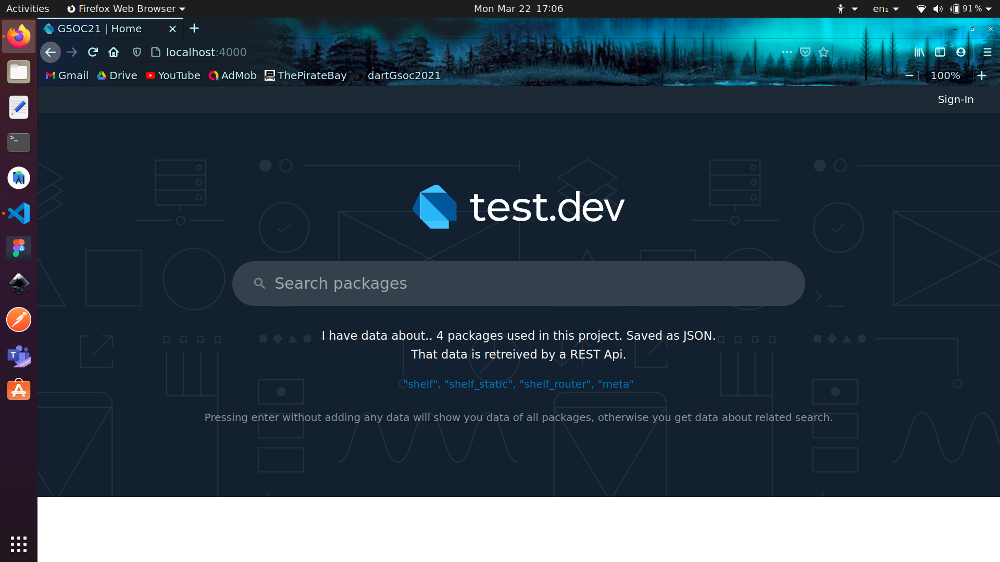
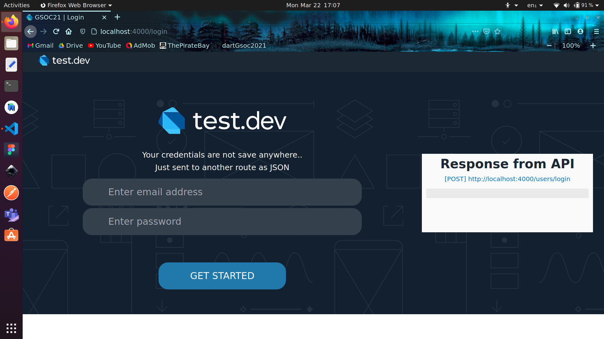
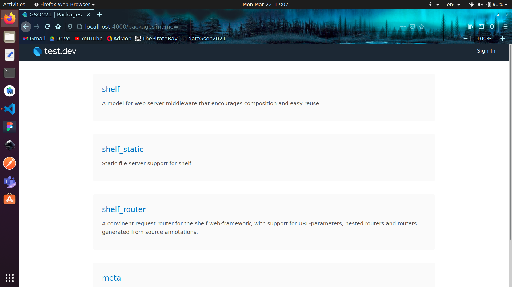

# Standalone pub-server

## Getting started - Sample project

This is to create a dart server using shelf packages, rendering HTML templates and handling JSON objects in the rest requests.

This is attempt to the [idea][IDEA-URI], standalone pub-server in dart. This should not be considered as final product but is for the first example project.

  

## Approach

This is my approach to the good sample project and not for the complete project. 
Complete approach would be mentioned in the proposal.

1.  **REST Api**:
With the help of `shelf_router` requests are routed to appropriate end-points and then appropriate results are rendered.
Following is the list working end-points, they are in accordance with [hosted pub repository specification][PUB-SPECS].
* `[GET]  http://<host>:<port>/packages/`
Returns all the packages that are present(in no particular order as of now). These packages are stored in `packages.json` file, later a database can be used.
* `[GET]  http://<host>:<port>/packages/?name=<query>`
Returns all the packages having similar text pattern as present in `query` text. An empty query results in returning all the packages.
* `[GET]  http://<host>:<port>/packages/<NAME>`
Returns only the package that matches the exact `name`.
* `[GET]  http://<host>:<port>/packages/<NAME>/version/<VERSION>`
Returns details of particular `version` of the asked package, which matches the `name`.
* `[POST] http://<host>:<port>/users/login`
For now, this route just returns back exact same JSON object that is sent to it, with additional `message` field.
> When running locally, `http://<host>:<port>` would be replaced with `http://localhost:4000`

2.  **Rendering HTML**:
* HTML templates are rendered with the help of `shelf_static` package. HTML and CSS are done similar to [pub.dev][PUB-DEV] site.
* Instead of sending response as JSON or text, files are sent as stream of string with response headers as `text/html`.
<table>
    <tr>
        <td></td>
        <td></td>
        <td></td>
    </tr>
    <tr>
        <th>Home Screen</th>
        <th>Login Screen</th>
        <th>Packages Screen</th>
    </tr>
</table>

## Problems faced
* Was not able to use dart code compiled to javascript, with HTML pages.

## My efforts to resolve the issue
* I tried to learn from [dart codelabs][DART-CODELAB] about connecting HTML with dart, by compiling dart into javascript.
* Dart code compiled into javascript was not apparently functional, I researched and found out that the scripts were not found the html pages because `build` folder was not visible.
* Fixed the issue by using `shelf_static` and rendering my build folder.

## How to run locally

* Clone this repository `git clone <repository-url>`, or download the zip file and unzip.
* Change your current working directory to this folder.
* I your terminal, run 
`dart pub get`  _(Installs the packages)_
`dart run server.dart` _(Starts the server)_

  

[IDEA-URI]: https://github.com/dart-lang/sdk/wiki/Dart-GSoC-2021-Project-Ideas#idea-standalone-pub-server

[PUB-SPECS]: https://github.com/dart-lang/pub/blob/master/doc/repository-spec-v2.md

[PUB-DEV]: https://pub.dev

[DART-CODELAB]: https://dart.dev/tutorials/web/low-level-html/connect-dart-html
